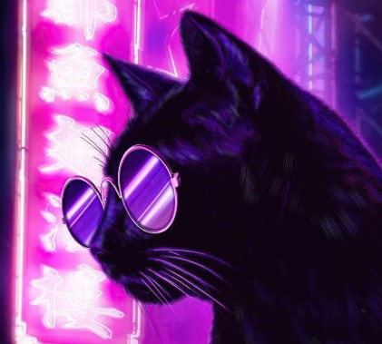

# Hola! Soy Izan
___
  Me llamo **Luca Gilardi Nolla**, aunque muchos me apodan **Izan**. Soy algo reservado, curioso empedernido y gustoso de ayudar.
  
  Actualmente me encuentro unicamente estudiando, en 2do año de Ingenieria en Sistemas de Información, pero no descarto la posibilidad de emprender la carrera profesional. Si bien tengo nociones básicas de programación y estoy aprendiendo de forma autodidacta, me interesa inclinarme hacia el lado de la seguridad informática.

  Vengo de Entre Ríos, aunque también pase por Santa Cruz, y resido en Garin(un poquito mas allá de Escobar).

  ### Me gusta:
  - Jugar videojuegos (principalmente con amigos, casi nunca juego solo).
  - Leer (sobre todo novelas historicas como las de Massimo Manfredi).
  - Investigar lo que mi curiosidad dictamine.

> _Si la curiosidad mató al gato, es que el gato era medio gil._ —yo
